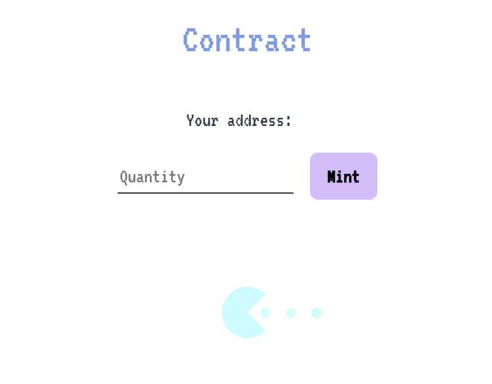

# Preparations

To run your application just execute the following command:

```bash
yarn serve
```

in the root of the `challenge` folder. As for now, you will not see much when running the app.



Let's fill it up with some content!

## 🗼 Setting up Arweave and Warp

As always, we will start by setting up Arweave and Warp clients. Head to [challenge/src/pst-contract.ts](https://github.com/warp-contracts/academy/blob/main/academy-pst/challenge/src/pst-contract.ts) and initialize both of them.

```js
export const arweave: Arweave = Arweave.init({
  host: 'testnet.redstone.tools',
  port: 443,
  protocol: 'https',
});

export const warp: Warp = WarpWebFactory.memCachedBased(arweave).useArweaveGateway().build();
```

This time, we are using SDK's `WarpWebFactory` instead of `WarpNodeFactory` which will be safe to use in a web environment. Additionally, as we are in are in the test environment, we need to indicate that we don't want to use the default Warp gateway (if you would like to switch to mainnet - just delete this factory method).
Remember to export them as we will use them in a store for our app.

## 🆔 Indicating contract id

Head to [challenge/src/deployed-contracts.ts](https://github.com/warp-contracts/academy/blob/main/academy-pst/challenge/src/deployed-contracts.ts) and paste the id of your deployed contract.

## 💰 Generating wallet and adding funds

Head to [challenge/src/store/index.ts](https://github.com/warp-contracts/academy/blob/main/academy-pst/challenge/src/store/index.ts). Generate Arweave wallet, get wallet address and add some funds to it in dedicated places:

```js
const wallet = await arweave.wallets.generate();

const walletAddress = await arweave.wallets.getAddress(wallet);
await arweave.api.get(`/mint/${walletAddress}/1000000000000000`);
```

## 🔌 Connecting contract and wallet to Warp client

Connect your deployed contract and wallet to the Warp client

```js
const contract = warp.pst(deployedContracts.fc).connect(wallet);
```

## ⛏️ Set the state of the contract

You can get the state of your contract by destructuring the result of the PST method we already know - `currentState`. Thanks to having this object in the store, we will have constant access to the current state of the contract and we will be able to display all the addresses and their balances.

```js
const { state } = await contract.currentState();
```

That's it for the preparations! As you may notice, we used some things we've already learned while writing tests and deploying our contract.

## 🅰️ Preparing Arweave mainnet environment

If you want to create an application which enables interaction with the mainnet contract the only things you need to change in this section is indicating correct `host` in Arweave initialization (exactly like the last time - `arweave.net`) and pointing to the real wallet. This time it is best to detect if the user has ArConnect already installed. If yes - `arweaveWallet` object will be available in the `window` object and therefore you will be able to use ArConnect `connect` method. You can see its API in [ArConnect docs](https://docs.th8ta.org/arconnect/functions). You can also request necessary permissions. You can check a list of available permissions [here](https://docs.th8ta.org/arconnect/permissions).

```js
await window.arweaveWallet.connect(['ACCESS_ADDRESS', 'SIGN_TRANSACTION']);
```

This time we don't need a generating wallet or to fund it. Just remember that if the user of your app wants to interact with the contract, some AR tokens will be needed on their account.

After you connect user wallet to the application you will need to use the `use_wallet` hook when initializing the contract. It will then connect the contract to the user's wallet. You can achieve this by writing following code:

```js
const contract = warp.pst(deployedContracts.fc).connect('use_wallet`);
```
